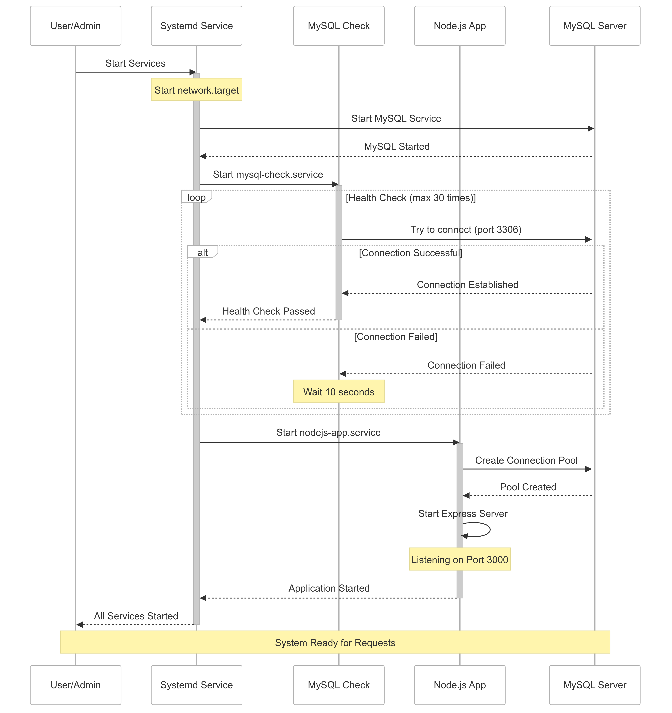

# Systemd, MySQL, and Node.js Service Orchestration

This repository contains scripts and configurations for orchestrating a **Node.js application**, **MySQL database**, and **systemd services** to ensure smooth service startup and dependency management.

## **Overview**
The setup ensures:
- MySQL is available before starting the Node.js app.
- Health checks are performed on MySQL before proceeding.
- Node.js application starts only after MySQL is confirmed running.
- Connection pooling is used for efficient database access.

---

## **System Flow**

**Steps:**
1. **Systemd Service Starts**:  
   - `network.target` is triggered.
   - MySQL service starts.
   
2. **MySQL Health Check**:  
   - A systemd service (`mysql-check.service`) runs a script to verify MySQL availability.
   - The script attempts to connect to MySQL (port **3306**) up to **30 times**.
   - If the connection fails, it retries every few seconds.
   - Once successful, it signals readiness.

3. **Node.js App Starts**:  
   - Waits **10 seconds** to ensure MySQL stability.
   - A connection pool is created for efficient database interactions.
   - The Express.js server starts and **listens on port 3000**.

4. **System Ready for Requests**:  
   - The application is fully operational and can handle incoming API requests.

---

